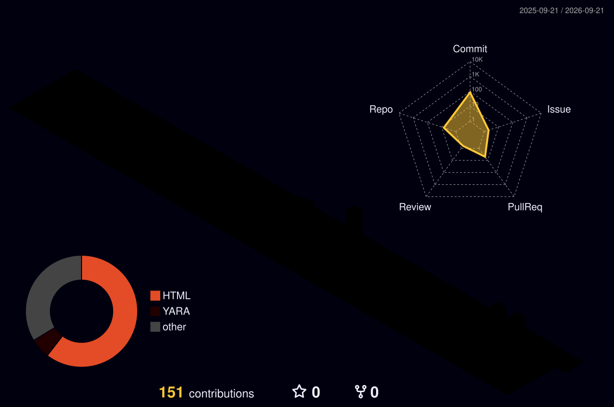

<!-- 🏴 FLAG{y0u_f0und_my_pr0f1l3} — if you're here, you're one of us -->


<div align="center">

<a href="https://github.com/paolocostanzo">
  
</a>

<br/>

[](https://www.paolocostanzo.com)
[](https://linkedin.com/in/paolocostanzoit)
[](https://www.researchgate.net/profile/Paolo-Costanzo-2)
[](https://paolocostanzo.github.io)
[](mailto:me@paolocostanzo.com)

<br/>


</div>

---

## `> cat /proc/paolo/status`

```python
class PaoloCostanzo:
    role        = "Chief Endgame Officer @ CoDe RTD"
    aka         = ["nonèCostanzo", "the guy who debugs criminal orgs on Easter"]
    location    = "🇵🇦 Panama — 🌐 Remote Worldwide"
    company     = "CoDe - Research & Technological Development"
    focus       = ["Cloud & AI Security", "Offensive Security", "Threat Intelligence", "OSINT"]
    teaching    = ["ITS ICT Piemonte", "Forte Chance ETS", "Istituti Galileo Galilei"]
    languages   = ["Python", "Bash", "JavaScript", "Go", "C/C++"]
    speaks      = {"it": "Native", "en": "Professional", "fr": "enough to order croissants"}
    side_quests = ["Scuba Diving Instructor (CMAS/NADD/DAN)", "trained with ex-Navy GOI operator"]
    fun_fact    = "spent Easter 2026 infiltrating Telegram crypto-drainer channels instead of eating colomba"
    philosophy  = "I am always doing that which I cannot do, in order that I may learn how to do it."
```

---

## `> systemctl status paolo.service`

```
● paolo.service — Chief Endgame Officer
   Loaded: loaded (/etc/systemd/system/paolo.service; enabled)
   Active: active (running) since Aug 2020
   Tasks:  4 (limit: ∞)    Memory: caffeinated

   ├─ PID 1  [CoDe RTD] Co-Founder & CEO
   │    ├─ AI-powered SaaS: digital content & identity protection
   │    ├─ Multi-region AWS infra (encrypted, scalable, GDPR-compliant)
   │    ├─ AI-driven abuse detection at scale: accounts, copyright, piracy
   │    ├─ META tech partner — anti-piracy enforcement on social platforms
   │    └─ E2E encryption · granular IAM · secure cloud governance
   │
   ├─ PID 2  [Professor] IT & CyberSec Educator
   │    ├─ ITS ICT Piemonte → Pentest & Network Security (SOC/CySec track)
   │    ├─ Forte Chance ETS → Networking, Cisco labs, threat mgmt
   │    ├─ Istituti Galilei → Systems, Networks, Telecom
   │    └─ Methodology: recon → enum → exploit → report (yes, even in class)
   │
   ├─ PID 3  [Researcher] Threat Intel & OSINT
   │    ├─ Iranian APT campaigns — found what Unit 42 & CloudSEK missed
   │    ├─ Crypto-drainer DaaS: $13,960 traced, Telegram infra infiltrated
   │    ├─ CVE analysis · malware reversing · C2 mapping
   │    └─ "I take things apart and watch what moves at the edges"
   │
   └─ PID 4  [Side Quest] Scuba Diving Instructor
        ├─ CMAS / NADD / DAN — diving since 2006, instructor since 2018
        ├─ Trained with ex-GOI (Italian Navy Special Forces) operator
        └─ Because sometimes the real vulns are 30 meters deep
```

---

## `> cat /var/log/achievements.log`

| Year | Entry |
|------|-------|
| 🏅 2026 | **Global 100 Winner** — Top 100 cybersecurity professionals worldwide |
| 🏅 2024 | **Up2Stars Intesa Sanpaolo** — Selected innovative startup |
| 🥇 2022 | **1st Place AI Week** — AI innovation competition |
| 🏅 2018 | **Digithon Finalist** — CoDe project |
| 📜 × 3 | **3 Patents** — Digital watermarking & video content distribution systems |
| 📄 × 2 | **2 Research Papers** — Operation Epic Fury (Iranian APT) + TRON Drainer-as-a-Service |

---

## `> cat /etc/research/publications.bib`

- **Operation Epic Fury: What the Reports Missed** — Independent OSINT analysis of the Iranian dual-platform cyber campaign targeting Israeli civilians. Undisclosed Windows payload, secondary C2 at 0/94 on VirusTotal, infrastructure active 8 months before anyone noticed. *(Feb 2026)*

- **Anatomy of a TRON Wallet Drainer-as-a-Service** — Deep dive into affiliate-based cryptocurrency theft operations on the TRON network. $13,960 in documented stolen funds, Telegram infrastructure infiltrated, takedown coordinated. *(2026)*

> 📚 Available on [ResearchGate](https://www.researchgate.net/profile/Paolo-Costanzo-2)

---

## `> ls -la /opt/arsenal/`

<div align="center">

**Offensive Security**


**Cloud & Infrastructure**


**Languages & Scripting**


**AI & Threat Detection**


</div>

---

## `> cat /etc/certs/verified.lst`

<div align="center">


</div>

> 📋 Full credentials → [Credly](https://www.credly.com/users/paolo.costanzo)

---

## `> tail -f /var/log/github.log`

<div align="center">


</div>

<div align="center">


</div>

<div align="center">


</div>

<div align="center">


</div>

---

## `> gl /var/log/3d-contributions.log`

<div align="center">



</div>

> *Generated daily via GitHub Actions — [yoshi389111/github-profile-3d-contrib](https://github.com/yoshi389111/github-profile-3d-contrib)*

---

## `> cat /dev/snake`

<div align="center">

<picture>
  <source media="(prefers-color-scheme: dark)" srcset="https://raw.githubusercontent.com/paolocostanzo/paolocostanzo/output/github-snake-dark.svg" />
  <source media="(prefers-color-scheme: light)" srcset="https://raw.githubusercontent.com/paolocostanzo/paolocostanzo/output/github-snake.svg" />
  
</picture>

</div>


---

## `> cat /var/www/blog/recent.log`

<!-- BLOG-POST-LIST:START -->
- ☁️ [I Wanted to Write a Quick Article. I Dismantled a Criminal Org Instead.](https://paolocostanzo.github.io/crypto-drainer-svuotatasche/) — *Tue Apr 07 2026 12:00 AM*
- 🇮🇷 [One GET, 169.254.169.254, IAM Credentials Served Fresh](https://paolocostanzo.github.io/ssrf-imds-ec2-credentials/) — *Tue Mar 31 2026 12:00 AM*
- 🌐 [€40, 2 Minutes, and a Student Who&#39;ll Never Trust Free Wi-Fi Again](https://paolocostanzo.github.io/cardputer-adv-wifi-security/) — *Sat Mar 21 2026 12:00 AM*
- 💀 [Operation Epic Fury: What the Reports Missed](https://paolocostanzo.github.io/operation-epic-fury-cyber-war-iran/) — *Tue Mar 17 2026 12:00 AM*
- 📡 [TIM, GeForce Now and the ICMP Black Hole](https://paolocostanzo.github.io/tim-packet-loss-gfn/) — *Tue Mar 10 2026 12:00 AM*
- 🔴 [AWS IAM: The 5 Most Common Misconfigurations](https://paolocostanzo.github.io/aws-iam-misconfiguration/) — *Sun Mar 01 2026 12:00 AM*
- 🔴 [Prompt Injection on Enterprise LLMs: How It Really Works](https://paolocostanzo.github.io/prompt-injection-llm/) — *Sun Mar 01 2026 12:00 AM*<!-- BLOG-POST-LIST:END -->

> 📖 **[Read all posts → paolocostanzo.github.io](https://paolocostanzo.github.io)**

---

## `> cat /etc/motd`

<div align="center">

```
┌──────────────────────────────────────────────────────────────────────┐
│                                                                      │
│   💼  Security consulting & architecture reviews                     │
│   🔐  Penetration testing & assessment (remote worldwide)            │
│   🎓  Cybersecurity education & mentoring                            │
│   🤝  If you build it, I'll try to break it                          │
│       (with a report and remediation, not just vibes)                │
│                                                                      │
│   📧  me@paolocostanzo.com                                            │
│   🌐  paolocostanzo.com  ·  paolocostanzo.github.io                 │
│                                                                      │
│   // I also accept bug reports on my own infra.                      │
│   // Find something? Tell me. Coffee's on me. ☕                     │
│                                                                      │
└──────────────────────────────────────────────────────────────────────┘
```

</div>

---

<div align="center">

> *"I am always doing that which I cannot do, in order that I may learn how to do it."*

**`root@costanzo:~# CEO who codes · Professor who pentests · Researcher who ships · Diver who debugs`**


</div>
